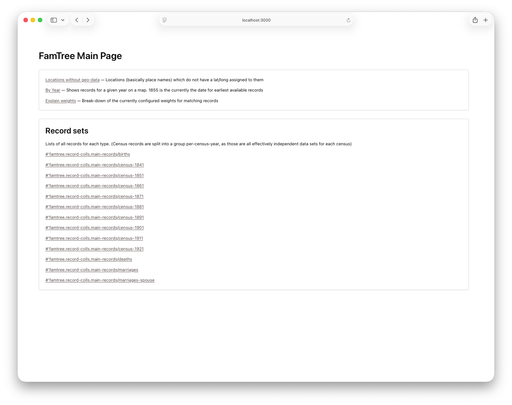
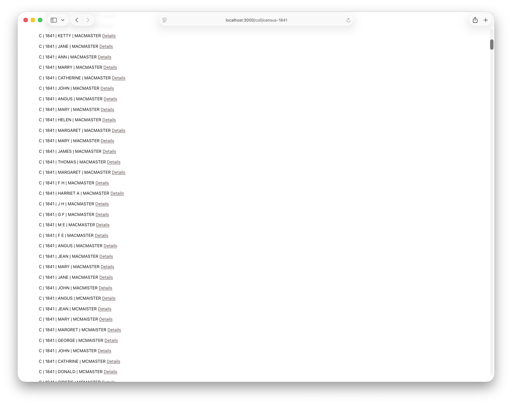
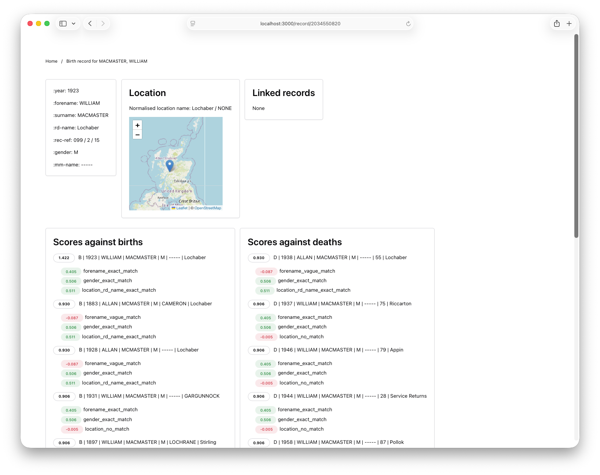
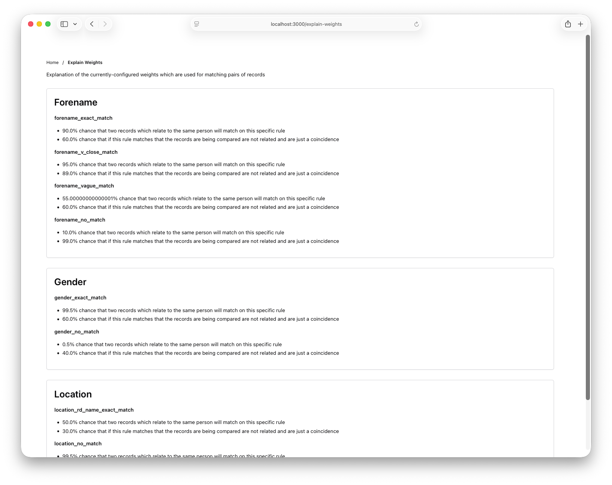
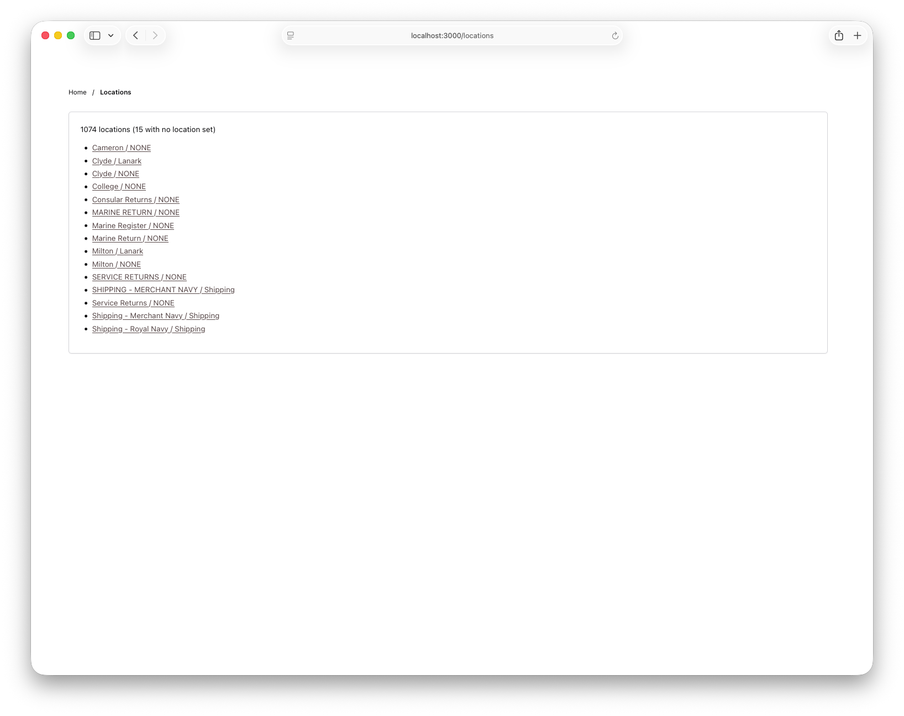
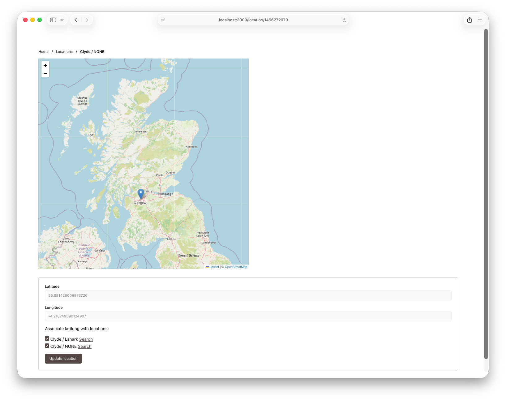
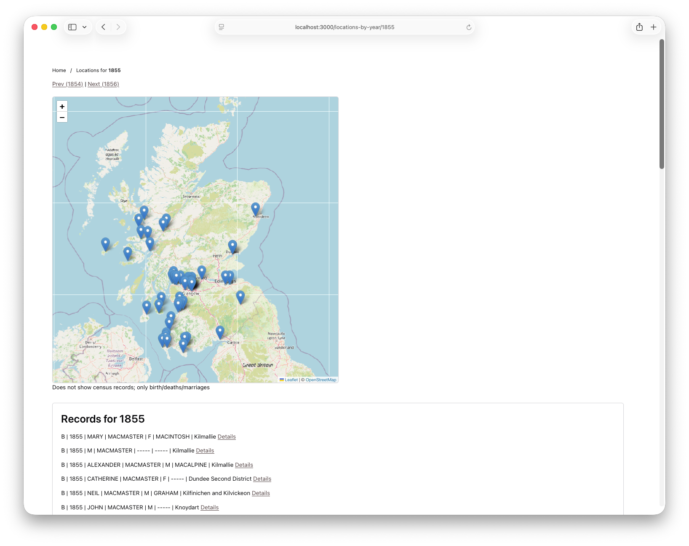

# famtree
A system to work with Scottish historical "people" records (births, deaths, marriages, census records) from [Scotland's People](https://www.scotlandspeople.gov.uk).

# Project objectives
- Develop my Clojure skills by building a larger project than the [small script-like project](https://github.com/pmcmaster/clj-cheesecal) I had previously implemented. (Wider objective is to demonstrate Clojure competence for potential employers.)
- Start with some simple run-once processes and work up to something which holds state and uses interaction to build up links between records.
- Experiment with Clojure web development libraries such as *ring* and *compojure* to build some simple UI for the tool.
- Possibly discover some hidden ancestors along the way. The aim of the project is to match up records, finding (for example) a birth record and a marriage record which likely involve the same person, and from there eventually be able to build of trees of related people.

# Project prerequisites
This project uses Clojure and [shadow-cljs](http://shadow-cljs.org). [clj-kondo](https://github.com/clj-kondo/clj-kondo) is used for linting but is not required to build the project. (I am developing this on a Mac, so [Homebrew](https://brew.sh) is used to install all of the base dependencies, and is used in the example commands shown here.)
- Clojure version 12.6.1673 is used (installed via``brew install clojure/tools/clojure``), running against openjdk (Temurin-27+35) (installed via `brew install --cask temurin`)
- Required Clojure libraries are managed via a `deps.edn` file; no specific dependencies on Leiningen, Boot etc.
- node.js is used for invoking shadow-cljs (installed via `brew install node`)
- shadow-cljs is used for CLJS (installed via `npm install --save shadow-cljs`)
- Optionally: clj-kondo for linting (installed via `brew install borkdude/brew/clj-kondo`)

## Data
Execution depends on there being some records data (in the form of `.csv` files) in the `/data` directory. It is not appropriate to share the actual data I am working with via a GitHub repo.

The code for sourcing the data for these records from the Scotland's People website is not included as part of this project.

**Next steps here**: I'm working on a process to generate synthetic data which would simulate some families/people, and some patchy record-keeping, over a couple of hundred years. Some work-in-progress on this is in the [synthetic-data branch](https://github.com/pmcmaster/clj-famtree/blob/synthetic-data/src/famtree/data_gen/core.clj).

# Building
To compile the CLJS files into JS it is necessary to run: `npx shadow-cljs compile mapping`. This provides the functionality for some small map views showing location data. During development `npx shadow-cljs watch mapping` can be used to allow dynamic refresh of these resources.

# Testing
There are some (not as many as there should be) unit tests. These can be executed by running: `clojure -X:test`

# Running
There are several modes of execution. Some early versions used a kind of one-shot, determinstic matching which reads records, does some matching and dumps out results. Subsequently there is a mode to run as a server to navigate records interactively.

## Deterministic modes
Two deterministic modes ('households' and 'child-parent relationships') do some fairly simple deterministic matching and dump out a long and not-very-comprehensible list of possible matches.

### Households
`clojure -X famtree.core/households`
Tries to match together adjacent people in census registers and estimate which are part of the same household, and identify generations of families. This runs across several census years to try to find patterns where the same people are present in a household in sucessive census records.

Example output below (*:rec-ref*, *:rd-name* and *:county-city* fields removed to save space). This shows a likely household, tracked across the 1911 and 1921 census data. Everyone has aged 10 years in the intervening period, though it is possible to see the slight 'wobble' in the data with Mary and Marion, who have an 11-year age difference. This may be because the census is taken at a time of year prior to a birthday in 1911 and after a birthday in 1921, or simply because the data recorded is not very accurate. Can also see a new addition to the family in/around 1921: Elizabeth.
```
===== 1911 =====

  Generation 1
#famtree.records.CensusRec{:forename ALEXANDER, :year 1911, :gender M, :age-at-census 39}
#famtree.records.CensusRec{:forename ELIZABETH, :year 1911, :gender F, :age-at-census 35}
  Generation 2
#famtree.records.CensusRec{:forename MARY, :year 1911, :gender F, :age-at-census 11}
#famtree.records.CensusRec{:forename JAMES, :year 1911, :gender M, :age-at-census 7}
#famtree.records.CensusRec{:forename MARION, :year 1911, :gender F, :age-at-census 5}
#famtree.records.CensusRec{:forename ALEXANDER, :year 1911, :gender M, :age-at-census 2}


===== 1921 =====

  Generation 1
#famtree.records.CensusRec{:forename ALEXANDER, :year 1921, :gender M, :age-at-census 49}
#famtree.records.CensusRec{:surname MCMASTER, :forename ELIZABETH, :year 1921, :gender F, :age-at-census 45}
  Generation 2
#famtree.records.CensusRec{:forename MARY, :year 1921, :gender F, :age-at-census 22}
#famtree.records.CensusRec{:forename JAMES, :year 1921, :gender M, :age-at-census 17}
#famtree.records.CensusRec{:forename MARION, :year 1921, :gender F, :age-at-census 16}
#famtree.records.CensusRec{:forename ALEXANDER, :year 1921, :gender M, :age-at-census 12}
#famtree.records.CensusRec{:forename ELIZABETH, :year 1921, :gender F, :age-at-census 0}
```

Another example shows identifying potentially three generations of a family living in one house. These are *likely* in the same house as they have the same 'rec-ref', showing what page of the record book they are on, though it may be adjacent houses which are recorded on the same page. *:rec-ref* field is not shown here. *:surname* and *:county-city* fields removed to save space.
```
  Generation 1
#famtree.records.CensusRec{:forename PETER, :year 1861, :gender M, :age-at-census 72, :rd-name Stranraer}
  Generation 2
#famtree.records.CensusRec{:forename PETER, :year 1861, :gender M, :age-at-census 41, :rd-name Stranraer}
#famtree.records.CensusRec{:forename JANET, :year 1861, :gender F, :age-at-census 38, :rd-name Stranraer
  Generation 3
#famtree.records.CensusRec{:forename JAMES, :year 1861, :gender M, :age-at-census 10, :rd-name Stranraer}
#famtree.records.CensusRec{:forename JOHN, :year 1861, :gender M, :age-at-census 5, :rd-name Stranraer}
#famtree.records.CensusRec{:forename WILLIAM J, :year 1861, :gender M, :age-at-census 2, :rd-name Stranraer}
```
### Child/parent relationships
`clojure -X famtree.core/link-same-and-parents`
Tries to match parents to their children. Small sample of output. *:rec-ref* and *:surname* fields removed to save space:
```
Possible marriage
#famtree.records.MarriageRec{:forename JOSEPH, :spouse-surname GREENHORN, :spouse-forename JANET, :year 1861, :rd-name Holytown}
Child
#famtree.records.BirthRec{:forename JOHN, :mm-name GREENHORN, :gender M, :year 1870, :rd-name Holytown}
#famtree.records.DeathRec{:forename JOHN, :age-at-death 56, :mm-name GREENHORN, :gender M, :year 1926, :rd-name Dalserf}
```

## Probabilistic matching - Proof-of-concept

`clojure -X famtree.core/prob-match-census` Matches two years of census data against each other using a probabilistic approach (described in more detail below). This was used to test out the scoring logic, and will likely be removed in future.

Example output below shows the best match (the 1.08 score) for the 1921 record against the 1911 'source' record. Other records and their scores are shown; the six-highest scores, and the two lowest. *:rec-ref* fields removed.
```
Source: #famtree.records.CensusRec{:surname MCMESTER, :forename ELIZABETH, :year 1911, :gender F, :age-at-census 46, :rd-name Falkirk, :county-city Stirling}
1.081879227576838 #famtree.records.CensusRec{:surname MCMASTER, :forename ELIZ, :year 1921, :gender F, :age-at-census 55, :rd-name Falkirk, :county-city Stirling}
0.9062656482270666 #famtree.records.CensusRec{:surname MACMASTER, :forename ELIZABETH, :year 1921, :gender F, :age-at-census 64, :rd-name St Mary and St Peter, :county-city Angus}
0.9062656482270666 #famtree.records.CensusRec{:surname MACMASTER, :forename ELIZABETH, :year 1921, :gender F, :age-at-census 25, :rd-name Perth, :county-city Perth}
0.9062656482270666 #famtree.records.CensusRec{:surname MACMASTER, :forename ELIZABETH, :year 1921, :gender F, :age-at-census 33, :rd-name Hillhead, :county-city Lanark}
0.9062656482270666 #famtree.records.CensusRec{:surname MACMASTER, :forename ELIZABETH, :year 1921, :gender F, :age-at-census 10, :rd-name Campbeltown, :county-city Argyll}
0.9062656482270666 #famtree.records.CensusRec{:surname MACMASTER, :forename ELIZABETH, :year 1921, :gender F, :age-at-census 32, :rd-name Renfrew, :county-city Renfrew}
...
-6.67957393363797 #famtree.records.CensusRec{:surname MCMASTER, :forename JAMES, :year 1921, :gender M, :age-at-census 61, :rd-name Calton, :county-city Lanark}
-6.67957393363797 #famtree.records.CensusRec{:surname MCMASTER, :forename DAVID, :year 1921, :gender M, :age-at-census 37, :rd-name Calton, :county-city Lanark}
```
Here it appears that the 'best scoring' record is indeed likely indicating two records for the same person, but the small difference in the match score maybe suggests that the weightings for the fields used for matching need adjustment. I think that the match closeness here should result in a larger positive signal from the best-matching score for the best-matching record.

## Server process
To start the web server process, execute: `clojure -M:server`. This will then be accessible at `localhost:3000`

### Example screens

Basic landing page with links to other sections.


Record list page, listing records associated with a particular record set.


Record detail, showing scores against other possibly-related records and the selected one. Will eventually show records which have been manually linked.


An explanation of the currently-configured weights (90.0%, 60.0% etc., shown below) being used for comparison.


A listing of places which do not have geolocation data assigned to them.


This page allows a geolocation to be associated with one or more placenames. It has a convenience link to search online for the placename, in case that is helpful in figuring out where it is. The data is persisted across runs.


List records and locations for a given year. Can click through the years to see clumps of people moving around.


# Project background
This system was created to work with census, birth, death and marrage records saved from national library of Scotland records. These begin around 1855 and some of them run to the present day.

Summary information for a record is freely-available via a search function provided on the Scotland's People web site. The full records, normally a digitized image of the actual paper record, are available by paying a small amount.

My aim for this project was (in addition to sharpening my Clojure skills) to save all the data for one family name (my own), and then see if it were possible to stitch together all the individual records in a coherent way, or at least do that for as many as possible. The hypothesis was that by building up some trees of people who I was ***not*** related to (but share a surname with) it might become clearer which of the remaining 'unassigned' people were worth further investigation. This has not quite been proven out yet, but the process is ongoing and enjoyable. 

## Data import
CSV files for each record type are imported as Clojure maps, which are then converted to record types for each of the collection types (currently births, deaths, marriages and census).

Birth, death and marriages are handled in individual collections for each of those types. Marriages are additionally treated slightly differently, in that a second collection is created with the forename/surname and spouse forename and spouse surname switched around. This means that marriage can be treated more simply by always having the primary person being considered to be the one marked forename and surname.

The census data is split into an individual collection for each year of census data, as those are more independent data sets. These are dealt with individually, more often looking at a single census by-year, rather than searching across all available census data.

## Initial work - Deterministic
To begin with I implemented deterministic approach, where several conditions were used to filter down a list of records matching against one other record. For example, the 'source record' might be a birth record. The system could then attempt to match this birth record against (e.g.) death records, making sure that the death record occurs after (in terms of time) to the birth record, that the names are a good match, and possibly that the location also matches.

The deterministic approach was rather a simplistic from a record matching point of view but was chosen as a good project to build up some familiarity with Clojure. Lots of of the matching is rather naive, and it does not produce useful results in terms of revealing links between records. There are also some utility functions which attempt to match in different ways, such as trying to identify families which all live together based on where their records appear in the census data.

### One-to-one match in both 'directions'

> [!NOTE]
> *Terminology used below: **source record** is a record that has been selected as a starting-point. We are looking for records which match that source record. The source record comes from the **source collection**: a collection of records of the same type (e.g., marriage records). **Target collection** is a set of records which are evaluated against the source record to look for a single match.*

In the case that that filtering of the target collection (comparing against the source record) results in **only one** matching record remaining, that single remaining record is assumed to be a good potential match for the source record. There may be cases where in one direction (source record to target collection) there is only one match, but if we re-run the process in reverse, taking the candidate 'matching' record and filtering down the source collection, there are many matches.

To avoid this, the deterministic code runs the search once in the 'source to target' direction, then, when it finds a single matching target record, re-runs the search in the opposite direction, effectively treating the found record as the source record, and the original source record's collection as the target collection. If this also results in a single record being found, then it indicates a likely one-to-one match. If the comparison was not run in both directions then it would be difficult to identify whether we had a one-to-one match or an n-to-one match (where the single found record potentially matches several records in the source collection).

## Web interface and probabilistic approach
Once it became clear that the deterministic approach was not going to be very fruitful or maintainable, some research on the matching problem was done (see *AI Usage & Learning Process* section below). The *Fellegi-Sunter* method seemed like an appropriate approach for this problem.

This method calculates a score of how closely two records match. This score changes with each field that is considered, and which weightings are given to how well the field matches. There are two weightings for each match. One is a **match weight** and the other is an **unmatch weight**.
Robin Linacre does a better job [explaining match and unmatch weights](https://www.robinlinacre.com/m_and_u_values/), and my attempts to paraphrase would not be as clear as his explanations.

Matching for different field types is done using different methods. There are some text matching functions which were advised by the reference documentation for record matching. These are implemented Clojure using the [clj-fuzzy library](https://yomguithereal.github.io/clj-fuzzy/clojure.html), which meets the requirements I have.

## ClojureScript
Some of the JavaScript code used for the small the mapping interface on the website, to show locations, was converted to use ClojureScript JavaScript. This is not a clear-cut beneficial use case for ClojureScript, though it did end up being a slightly cleaner solution than just having blocks of JavaScript, inside strings, inside Clojure code.

### shadow-cljs
There seem to have been a lot of changes around which systems to use to compile CLJS to JavaScript. Shadow CLJS was used, after some abandoned attempts using other systems. Ironically one of the easiest-to-follow tutorials which I found for getting shadow-cljs up and running in the way I was intending to use it was one intended for [using ClojureScript with Elixir](https://dev.to/stephcrown/how-to-set-up-a-clojure-script-and-phoenix-project-22g6). Ignoring the Elixir parts and following the rest was enough to get me up and running with shadow-cljs producing compiled JS code in the required location in my project.
The standard shadow-cljs commands can be used to reload the `.cljs` content within the project: `npx shadow-cljs watch mapping`

# AI usage and learning process
AI was not used to write any of code or documentation for this. I find that a slow and steady approach is more conducive to learning new things like this, so I'm not keen to "10x" this particular journey with AI.

After exhausting the usefulness of the basic deterministic approach, I prompted Claude to provide methodologies for more flexible record linking strategies:
> I have some records about various people who were alive from 1755 to 1960. The records are individual records for events, covering births, deaths and marriages. There are also census records (every 10 years) for part of the available timeframe. The data is inconsistent, so for example "P Smith, born 1775" may be the same as "Paulson Smithe, married 1796". What would be a good way to join together records which relate to the same person, or where people are related (e.g., parents, siblings)?

This produced useful pointers to the Fellegi-Sunter method of record matching, which led to an existing [Clojure implementation of that](https://github.com/oakmac/record-linking-talk), used to demonstrate medical record matching, and [a useful accompanying talk](https://youtu.be/rGKEOMUtJfE), both by Chris Oakman. (Chris Oakman's implementation was not reused directly, though the resulting code is quite similar due to it using the same underlying methodology.) Additional research following that (i.e., me searching, not me asking AI) led to Robin Linacre's [excellent pages explaining Fellegi-Sunter in detail](https://www.robinlinacre.com/probabilistic_linkage/), with examples.

No AI was used for 'coaching' for learning Clojure. I have two books which I've been reading through regularly as I go along: *Programming Clojure* (Miller, Halloway, Bedra) and *Getting Clojure* (Olsen). Both of these are great, and I've enjoyed this approach.

At the same time as improving my Clojure I was also working to pick up some other skills which I'd never quite found the time for, but had been wanting to investigate:
- I switched to using [fish](https://fishshell.com) for my shell - it seems to just do what I want without needing other shortcuts so often
- Using [Jujitsu](https://www.jj-vcs.dev/) instead of (but actually on-top-of) git. This has been a lot of fun. jj seems to have a much smaller mental footprint than git, but yet somehow more flexibility
- Using vim for text editing instead of TextMate and Xcode which I'd been using previously. This one was quite a steep learning curve, I'd say more-so than Clojure itself, but has been very rewarding. (I've been working through two books: *Practical Vim* and *Modern Vim*, both by Drew Neil)

# Limitations and caveats
- The records themselves are incomplete by definition, so getting a 'full picture' of history from this process is unrealistic.
- The project is also very much a work-in-progress. Although my Clojure proficiency has increased in the course of the project, the project itself has not realised the goals I envisaged for discovering relationships between records. This project is a hobby with no particular hard deadlines, so it has taken several turns around interesting Clojure learning directions which are not strictly related or necessary for the overall long-term project goal.
- The code is more heavily-commented than I might normally. This is intended to reveal more of my thinking behind writing it that might be necessary/useful for normal 'here is some code for you to use' vs 'here is some code to show my understanding of Clojure'.
- Code clean-up; a lot of the 'deterministic'-mode code is code that I would have normally removed and replaced with probabilistic implemetations. I have left it here as a better indicator of the journey the project has taken overall.
- Several TODOs remain in the code. Once the focus moves from 'learn Clojure better' to 'complete the project', it might be time to turn some AI friends loose on this, and see what happens.
- The weightings used for matching in the probabilistic method need some tuning. This could be done by-hand, with a little thinking about it. Additionally there is scope to introduce some sort of 'find the best matching solution' reinforcement-based, automated training approach. Care would need to be taken here to avoid finding some solution which "matches" the greatest number of records, but does so in a way that makes no sense!
- Lots of scope to add more unit tests. I have been enjoying building functionality and testing it out in the REPL or via very iterative development. I'd usually instead write more unit tests.
- The web interface is designed with running locally in mind, and without consideration of any concurrent access by multiple users. Some additional checking around contention on shared access (e.g., two people setting a geolocation for a place) would need some conflict resolution logic. This could take the form of checking whether the initial state a user last viewed is still the 'previous' state when they commit a change. This would make clear which state is chosen as the one that 'wins' in the case of contention, and would show some feedback in the case of a rejected change due to a conflicting edit.

# Next steps
- Manually setting up linking between records, and showing that on the web interface. **This is what I am actively developing at the moment**.
- More test coverage.
- Removal of old code.
- I'd like to have more generative tests, and ideally have some generative process for sample data, both using likely using Spec. (There is some [previous exploratory work using spec in another branch](https://github.com/pmcmaster/clj-famtree/blob/spec/src/famtree/record_specs.clj), which I will resurrect at some point.) Work-in-progress on synthetic data generation is in the [synthetic-data branch](https://github.com/pmcmaster/clj-famtree/blob/synthetic-data/src/famtree/data_gen.clj).
- Graphical display of trees of linked records.
- Address the several TODOs, mostly relating to minor clean-ups required in the code.
